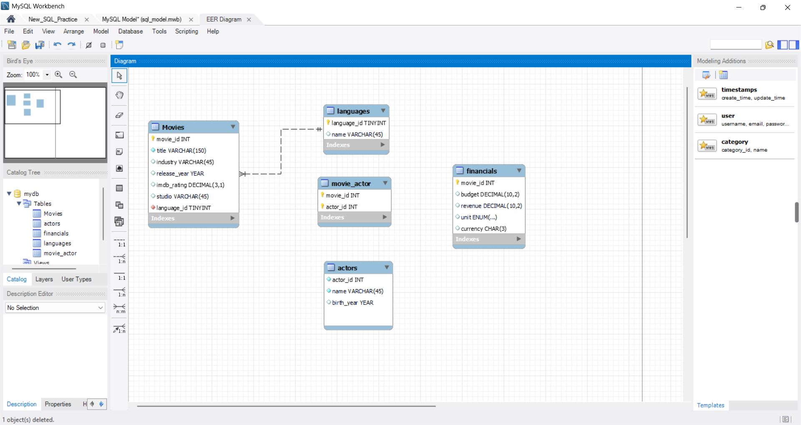
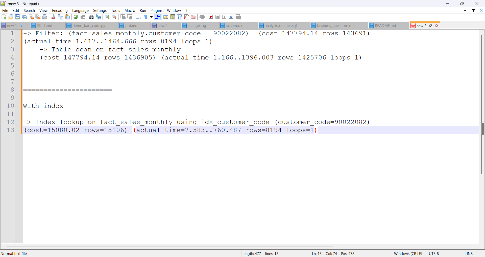
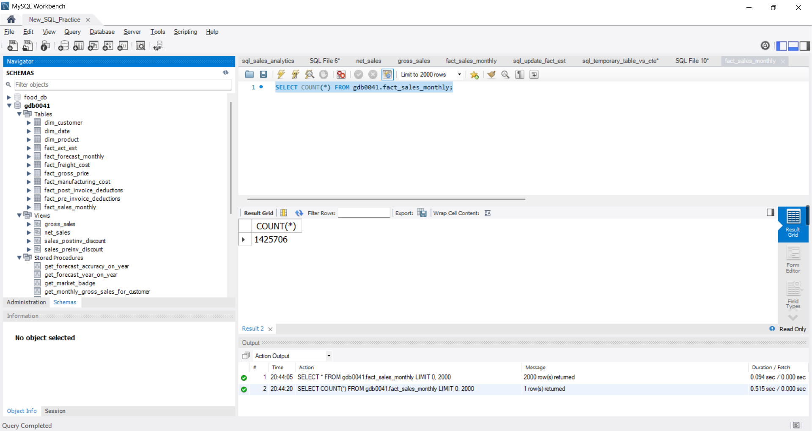

# SQL Sales Analytics & Query Optimization

A business-focused **MySQL analytics project** using a 1.4M+ row retail sales dataset to analyze sales performance, customers, products, markets, discounts, and forecast accuracy. The project also demonstrates reusable SQL database objects and query-performance optimization using indexes and `EXPLAIN ANALYZE`.

## Why this project matters

This project is organized around the type of questions an analytics or business team would ask—not just around SQL syntax.

- How are monthly and yearly sales performing?
- Which markets and customers contribute the most?
- Which products lead each division?
- How do discounts affect net sales?
- How accurate are forecasts versus actual sales?
- How can a query against a large fact table be optimized?

## Technical Highlights

- **MySQL:** joins, aggregations, CTEs, subqueries, temporary tables
- **Advanced SQL:** window functions, `DENSE_RANK()`, fiscal-period analysis
- **Database objects:** views, stored procedures, stored functions
- **Data modeling:** fact/dimension analytical structure, generated columns, composite keys
- **Performance:** indexes and `EXPLAIN ANALYZE`
- **Business analytics:** gross sales, net sales, market share, product ranking, forecast accuracy

## Performance Case Study

A customer-level filter initially used a table scan across approximately **1.43M rows**. After adding an index on `customer_code`, the observed execution plan changed to an **index lookup**.

| Metric | Before | After |
|---|---:|---:|
| Access method | Table scan | Index lookup |
| Rows at relevant plan node | ~1,425,706 | ~8,194 |
| Reported plan-node time | ~1,396 ms | ~60 ms |

The timing is reported from the relevant execution-plan node and is not presented as a universal end-to-end speedup claim. See [`docs/performance-case-study.md`](./docs/performance-case-study.md) for the methodology and engineering caveats.

## Visual Evidence

### Data Model



The diagram provides a visual view of the analytical tables and their relationships used throughout the project.

### Query Optimization



The MySQL Workbench execution-plan evidence complements the before/after SQL and documents the observed optimization work.

### Dataset Scale



The screenshot provides visual evidence of the working dataset scale referenced in the project.

## Project Structure

```text
sql-sales-analytics/
├── docs/
│   ├── images/
│   │   ├── data_model.png
│   │   ├── query_optimization.png
│   │   └── total_rows.png
│   ├── business-questions.md
│   ├── data-dictionary.md
│   ├── data-model.md
│   ├── performance-case-study.md
│   ├── query-optimization.md
│   └── validation-notes.md
└── sql/
    ├── 01_schema/
    ├── 02_business_analysis/
    ├── 03_advanced_sql/
    ├── 04_views/
    ├── 05_functions/
    ├── 06_stored_procedures/
    └── 07_performance_optimization/
```

## Data Model

The analysis uses a logical fact/dimension structure centered on `fact_sales_monthly`. Business keys connect sales to customer, product, date, pricing, forecast, and deduction data. See [`docs/data-model.md`](./docs/data-model.md) for the documented relationships and modeling caveats.

## Performance Evidence

The optimization is backed by the SQL used before and after indexing plus the observed `EXPLAIN ANALYZE` results. See [`docs/performance-case-study.md`](./docs/performance-case-study.md) and [`sql/07_performance_optimization/`](./sql/07_performance_optimization/) for the reproducible query and index definition.

## Data & Reproducibility

The repository contains curated SQL and selected derived outputs rather than raw MySQL Workbench history. Source datasets may be subject to their original distribution terms and are not assumed to be redistributable.

Raw Workbench history is intentionally excluded because it can contain local credentials, connection details, and machine-specific paths.
