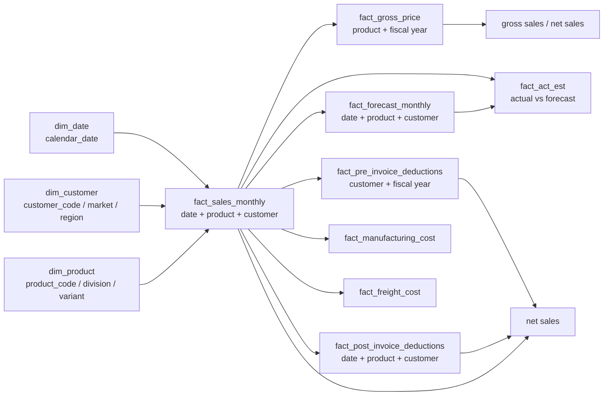

# Logical Data Model

The analysis is centered on `fact_sales_monthly`, with customer and product dimensions plus supporting pricing, forecast, cost, freight, and deduction facts.

> **Modeling note:** this repository documents the relationships used by the analytical SQL. They are logical join relationships; it does not claim that physical foreign-key constraints were defined in the source `gdb0041` database.

## Analytical architecture

## Core grain and keys

### `fact_sales_monthly`

The central sales fact is analyzed at the business grain of:

**`date + product_code + customer_code`**

The working dataset contains approximately **1.43 million records**. fileciteturn60file0

The analytical work also derives `fiscal_year` from the calendar date and uses it throughout pricing and fiscal-period analysis.

### `fact_forecast_monthly`

Forecast records use the same date/product/customer business grain, allowing actual and forecast quantities to be matched consistently.

### Fiscal-year-aware pricing

`fact_gross_price` is joined using both:

- `product_code`
- fiscal year

This matters because the applicable product price can depend on the financial year rather than product alone. The reusable `gross_sales` view follows this same join logic. fileciteturn30file0

## Core relationships

| From | To | Join logic | Purpose |
|---|---|---|---|
| `fact_sales_monthly` | `dim_customer` | `customer_code` | Customer, market, region analysis |
| `fact_sales_monthly` | `dim_product` | `product_code` | Product, variant, division analysis |
| `fact_sales_monthly` | `dim_date` | `date = calendar_date` | Calendar/fiscal analysis |
| `fact_sales_monthly` | `fact_gross_price` | `product_code + fiscal_year` | Gross sales calculation |
| `fact_sales_monthly` | `fact_forecast_monthly` | `date + product_code + customer_code` | Actual vs forecast comparison |
| Sales | Pre-invoice deductions | `customer_code + fiscal_year` | Discount adjustment |
| Sales | Post-invoice deductions | `date + product_code + customer_code` | Post-invoice adjustment |

These relationships are the logical join paths used by the project, not a claim of enforced database constraints. fileciteturn59file0

## Supporting tables

- `fact_forecast_monthly` — forecast quantities
- `fact_gross_price` — fiscal-year product pricing
- `fact_manufacturing_cost` — manufacturing-cost inputs
- `fact_freight_cost` — freight-cost inputs
- `fact_pre_invoice_deductions` — pre-invoice discount inputs
- `fact_post_invoice_deductions` — post-invoice deduction inputs
- `fact_act_est` — combined actual-vs-forecast analytical dataset

## Why this model is useful

The structure separates **business entities** such as customers and products from **measurable events and calculations** such as sales, forecasts, pricing, costs, and deductions. That makes the same underlying model reusable for:

- gross-sales reporting
- net-sales analysis
- market and regional share
- product rankings
- forecast accuracy
- performance optimization

## Interview talking points

A strong explanation of this model should cover:

1. Why `fact_sales_monthly` is the central fact.
2. What the grain of a sales record means.
3. Why `fact_gross_price` requires fiscal year in the join.
4. Why actuals and forecasts need a three-column business key.
5. The difference between a logical join relationship and a physical foreign key.
6. Why dimensions such as customer and product are separated from measurable sales facts.
